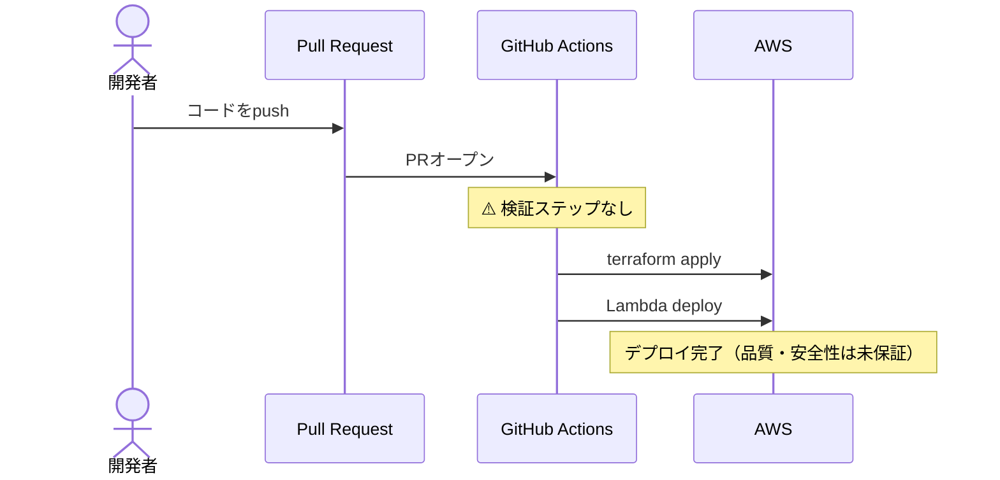
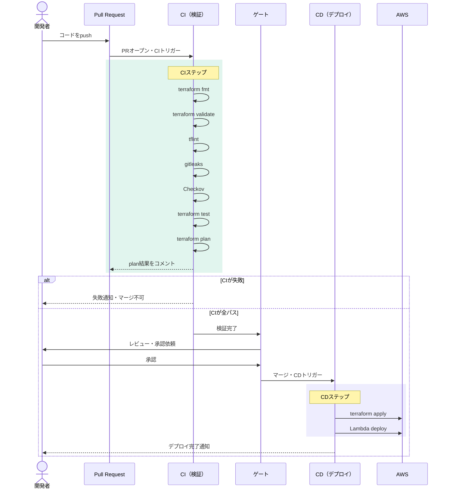

# CI/CDパイプライン運用定義

## Before / After：ワークフロー比較

### Before：現状（CDのみ・CIなし）



### After：あるべき姿（CI/CD完成形）



---


## 概要

本ドキュメントは、GitHub Actions を用いた Terraform × AWS の CI/CD パイプラインにおける運用のあるべき姿を定義したものです。現状の構成に対するレビュー指摘の根拠としても活用できます。

---

## 1. CI/CDのあるべき姿

CI/CD パイプラインは「コードの変更が、検証されてから、段階的に本番へ届く」流れを自動かつ再現性を持って回す仕組みです。

この流れは3つの要素で構成されます。

- **検証（CI）**: 変更が正しいか・安全か・品質を満たしているかを自動で確かめる
- **ゲート**: 検証をパスしないと次に進めない制御の仕組み。人間の承認が必要な場面もここに含まれる
- **デリバリー（CD）**: 検証済みのものを、決まった手順で、決まった環境へ届ける

> CIなきCDは「何を届けているかわからないまま届ける」状態になる

---

## 2. ITILサービスバリューチェーン対応表（現状の抜け漏れ）

### 2-1. パイプライン自体をコードとして管理する

| 運用項目 | SVCの活動 | インプット | アウトプット | 担当 | 現状 |
|----------|-----------|-----------|-------------|------|------|
| 変更管理 | 設計と移行 | 変更要求・PRレビュー依頼 | 承認済み変更・変更履歴 | チームリード | 不明 |
| バージョン管理 | 取得と構築 | Actionバージョン情報 | 固定済みワークフロー・依存関係台帳 | 開発者 | **欠如** |

### 2-2. 壊れたときに誰がどう直すかを決めておく

| 運用項目 | SVCの活動 | インプット | アウトプット | 担当 | 現状 |
|----------|-----------|-----------|-------------|------|------|
| 障害検知 | 提供とサポート | 失敗通知・エラーログ | 担当者アラート・インシデント起票 | 当番担当 | **欠如** |
| 障害対応 | 提供とサポート | インシデント情報・影響範囲 | 復旧済みパイプライン・障害報告書 | 担当エンジニア | **欠如** |
| エスカレーション | 関与 | 対応困難な障害・影響拡大 | 上位担当者への引き継ぎ・通知 | チームリード | **欠如** |

### 2-3. 定期的な見直しの仕組みを持つ

| 運用項目 | SVCの活動 | インプット | アウトプット | 担当 | 現状 |
|----------|-----------|-----------|-------------|------|------|
| 定期レビュー | 改善 | 実行履歴・失敗率・実行時間 | 改善提案・優先課題リスト | チーム全員 | **欠如** |
| 依存関係更新 | 改善・取得と構築 | 新バージョン情報・セキュリティアドバイザリ | 更新済みワークフロー・脆弱性対応記録 | 担当エンジニア | **欠如** |
| 計画・方針策定 | 計画 | 組織方針・新要件 | 更新されたCI/CD方針・ロードマップ | チームリード | **欠如** |

---

## 3. 運用定義の5項目

各運用行動を定義する際は以下の5項目で整理します。

| 項目 | 問い | 定義すべき内容 | 未定義の場合のリスク |
|------|------|---------------|-------------------|
| **誰が** | 責任者・実施者は誰か | 開発・運用・SOCの役割分担。エスカレーション先 | 属人化・対応漏れ |
| **いつ** | タイミング・頻度は | 定期レビューのサイクル。障害時の対応期限。Dependabot PRの処理期限 | 対応遅延・脆弱性の放置 |
| **どこで** | 作業・記録の場所は | 変更はGitHub PR上で。インシデントはチケット管理ツールで。通知はSlack等で | 記録の散逸・追跡不能 |
| **何を** | 対象・内容は何か | ワークフローファイル・Actionバージョン・IAMロール・シークレット等 | 対象の見落とし |
| **なぜ** | 判断の根拠は何か | 変更・非変更の理由をPRやチケットに残す。意図的な判断と放置を区別する | 判断の属人化・後からの追跡不能 |

---

## 4. 推奨ツール一覧

### 4-1. GitHub標準機能（追加コストなし）

| ツール | 役割 | 優先度 | 備考 |
|--------|------|--------|------|
| Dependabot | ActionやライブラリのバージョンアップPRを自動生成。脆弱性検出時はアラートも発報 | 最高 | `.github/dependabot.yml` 1ファイルで有効化。PRの処理フローを運用ルールとセットで定義すること |
| Secret Scanning | リポジトリにコミットされたシークレットをGitHubが自動検出 | 高 | Push Protection も合わせて有効化することを推奨 |

### 4-2. CIパイプラインに組み込むツール

#### コード品質・検証

| ツール | 役割 | 優先度 | 備考 |
|--------|------|--------|------|
| `terraform fmt` | Terraformコードのフォーマットチェック | 最高 | CIの最初のステップに配置。フォーマット違反でfailさせる |
| `terraform validate` | Terraformのシンタックス検証 | 最高 | `terraform fmt` の後に実行 |
| tflint | Terraformの静的解析。非推奨の書き方・構文エラーを検出 | 高 | Checkovとは役割が異なり、コードの品質・正確性に特化 |
| Terraformテスト | テストコードによる構成の動作検証 | 高 | 既に導入予定。CIのステップとして `terraform test` を実行 |

#### セキュリティスキャン

| ツール | 役割 | 優先度 | 備考 |
|--------|------|--------|------|
| Checkov | IaCのセキュリティ設定の問題を検出。TerraformのS3バケットの暗号化漏れ・IAMの過剰権限等 | 最高 | Terraform CI/CDにおけるセキュリティスキャンの標準的な選択肢 |
| gitleaks | シークレットの検出に特化。APIキー・パスワード・トークン等のハードコードを検出 | 高 | GitHub Secret Scanningと役割は近いが、CIパイプライン内でPRのタイミングに検出を走らせることで二重の防御になる |

### 4-3. 推奨するCIステップの順序

```
1. terraform fmt       # フォーマットチェック
2. terraform validate  # シンタックス検証
3. tflint              # 静的解析
4. gitleaks            # シークレット検出
5. Checkov             # セキュリティスキャン
6. terraform test      # テストコード実行
7. terraform plan      # 差分確認・PRにコメント
```

> 上記を全てパスした場合のみ `terraform apply` のゲートを開く

---

## 5. 運用上の注意事項

### Dependabotの運用ルール（必ず定義すること）

Dependabotは導入するだけでは不十分です。上がってくるPRを処理しないとリポジトリにPRが溜まり続け、放置される状態になります。以下を事前に定義してください。

- PRのレビュー担当者
- マージ期限の目安（例：セキュリティ系は7日以内、通常は月次レビュー時）
- マージしない場合の理由記録のルール（「なぜ」の5項目に対応）

### SOCとの連携フロー

SOCがCI/CDに影響しうる変更（IAMポリシー変更・セキュリティグループ変更・シークレットローテーション等）を行う場合は、事前に運用担当へ通知するフローを定義してください。事後対応になると原因特定に時間がかかります。

### `ubuntu-latest` の取り扱い

GitHubホスト型ランナーとして `ubuntu-latest` を使用する場合、OSのメンテナンスはGitHub側が担いますが、以下の点に注意してください。

- GitHubがOSバージョンを上げた際の動作変化を検知するため、CIの実行ログを定期的に確認する
- 重大な変更はGitHubのリリースノートやセキュリティアドバイザリで通知されるため、監視の仕組みを持つ

---

## 6. レビュー指摘の優先順位

| 優先度 | 指摘内容 | 対応アクション |
|--------|---------|--------------|
| 最高 | CIが存在せず、検証なしにデプロイが走る状態 | `terraform fmt` / `validate` / Checkov / gitleaks をCIステップとして追加 |
| 最高 | 依存するActionのバージョンが固定されていない | コミットハッシュ固定またはバージョン固定に変更 |
| 高 | Dependabotが未設定 | `dependabot.yml` を追加。処理フローの運用ルールとセットで定義 |
| 高 | 障害検知・対応フローが未定義 | 通知先・担当者・エスカレーション先を定義 |
| 中 | 定期レビューの仕組みがない | レビューサイクルとオーナーを決める |
| 中 | 判断の根拠が記録されない運用になっている | PRおよびチケットに「なぜ」を残すルールを定義 |
