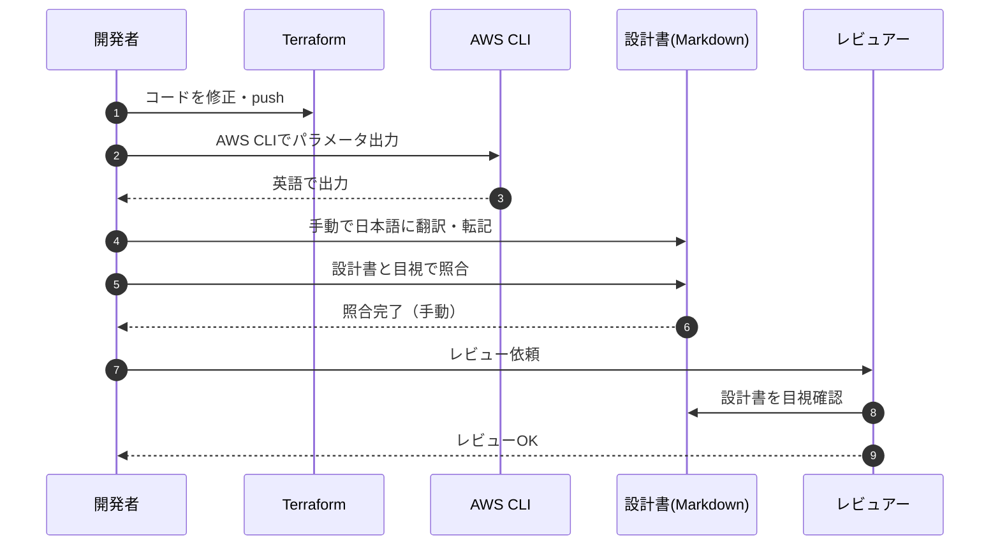
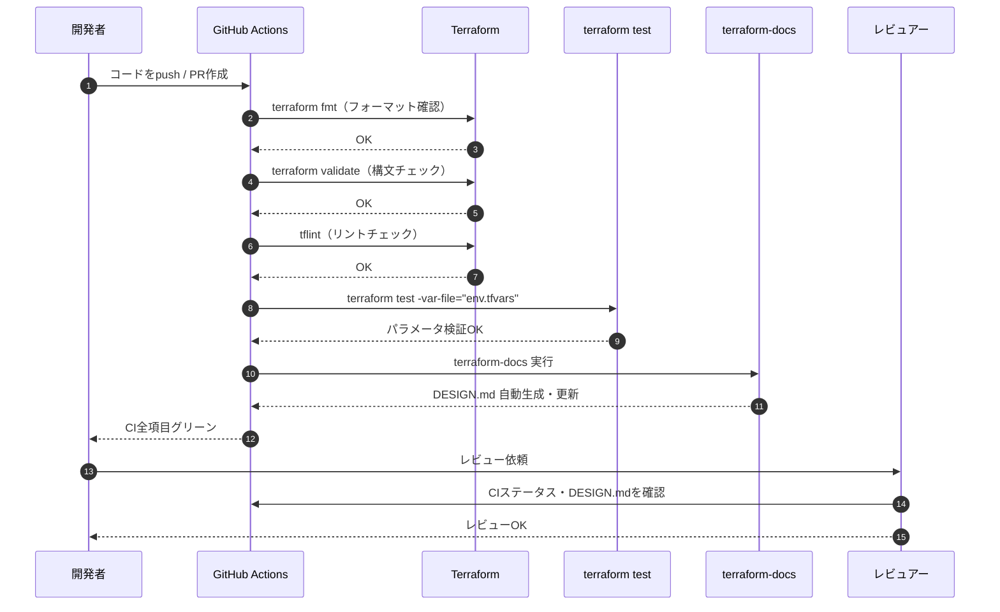
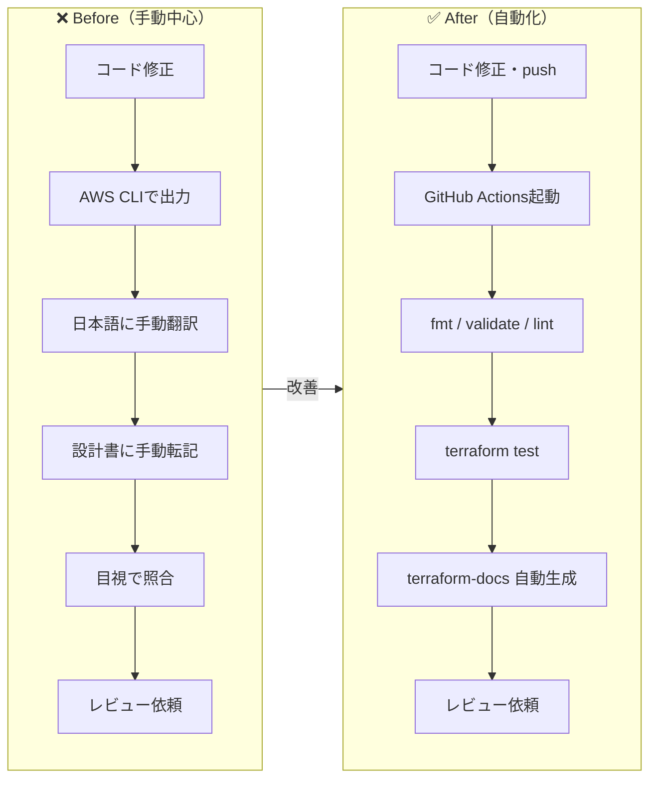

# CI ワークフロー ビフォーアフター

---

## Before（現状）

---

## After（改善後）

---

## ワークフロー比較

---

## 改善ポイントまとめ

| 項目 | Before | After |
|------|--------|-------|
| 設計書の言語 | 日本語（手動翻訳） | 英語（コードから自動生成） |
| パラメータ照合 | 目視で手動照合 | terraform test で自動検証 |
| ドキュメント更新 | 手動で転記 | terraform-docs で自動生成 |
| 信頼できる情報源 | Markdownの設計書 | Terraformコード・tfvars |
| CI組み込み | fmt / validate / lint のみ | test / docs 生成も追加 |
